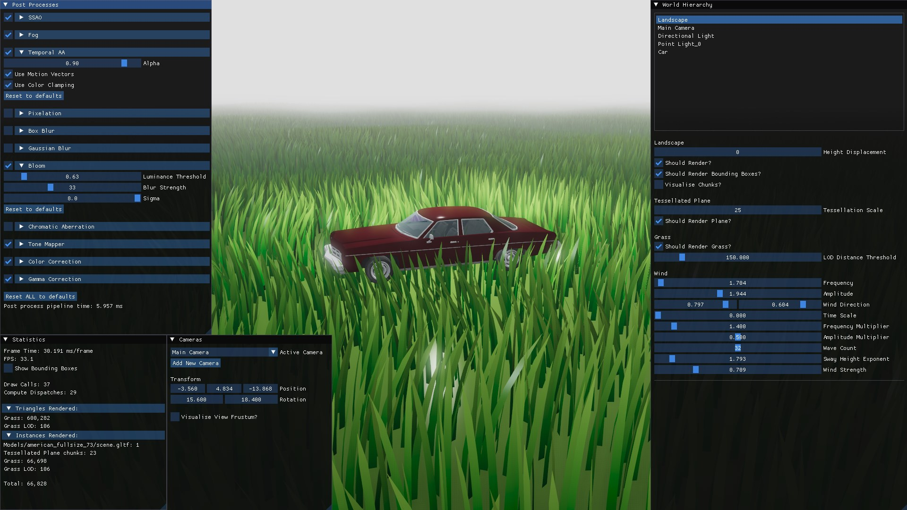

# NuaEngine

A DirectX 11 renderer using deferred shading with support for loading models, post process effects, tessellated terrain and more.

## Post Processes
### SSAO
With SSAO

Without SSAO

### Temporal Anti-aliasing
Left: No TAA, Right: With TAA

TAA improvements

## Animated grass

## Deferred shading

